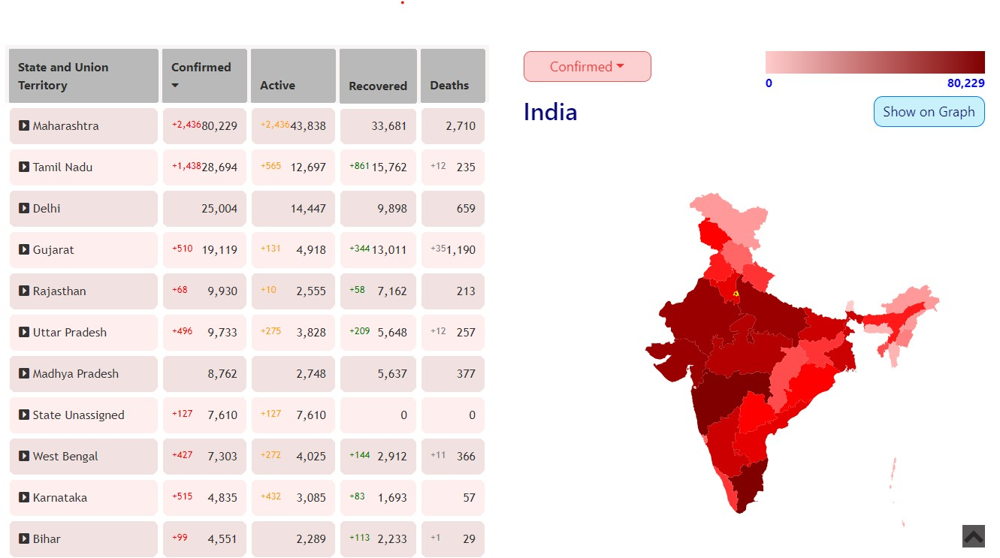

## COVID19 INDIA STATUS - https://covid19indiastatus-da4dc.web.app/

A tracker created with React.JS to monitor the spread of the Novel Coronavirus (COVID19) in India,
using the figures from a crowd sourced database.

- Features:
  - National numbers.
  - State-wise numbers.
  - District-wise numbers.
  - Choropleth map of India depicting states.
  - Choropleth map of states depicting districts.
  - Graph showing daily changes - nation-wide & state-wide.
  - Confirmed, active, recovered, death, recovery-rate & death-rate, ~~state-wide zones~~.
  - Light & dark mode.

* Homepage: 

* My email ID: mehulsengupta20@gmail.com

* Link to API (datasource): https://api.covid19india.org/

* MIT License

---
